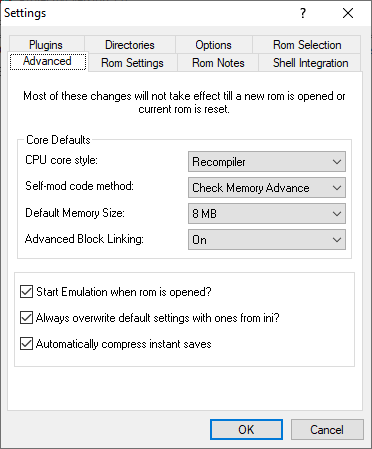
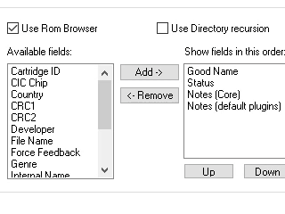
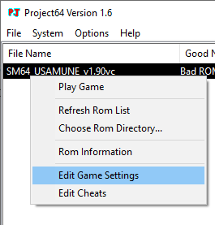
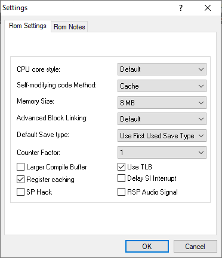

# Basic configuration

Upon starting the emulator for the first time, you will be greeted with a splash screen with a language selection dropdown. I suggest keeping it set to **English**, as it will make it easier to follow the guide. 

After that, the main application window will appear, which contains a ROM browser and a menu bar. If you have a folder with your N64 games in it, you can select it by going into **File -> Choose Rom Directory**.  After that, click on **Options -> Settings**, then click on the **Options** tab and uncheck **Hide Advanced Settings**. Not strictly necessary, but I also suggest unchecking **Pause emulation when window is not active** and checking **Remember selected cheats**, if you plan on using practice codes.

After that, press OK and open the settings window again. New tabs should appear. First, go to **Advanced** tab. The settings in here will apply to every ROM. Change **Default Memory Size** to **8 MB** as shown. Many romhacks, including the Usamune practice ROM as well as some GameShark practice codes require the additional memory to work correctly. 

#### Fixing the "Bad ROM?" 

If you plan on using the built-in ROM browser, I strongly recommend changing some options to make it more usable. Click on the **Rom Selection** tab. Here you can configure the visible columns amongst couple other things. By default, Project64 will only display a "Good Name" of the ROM, which is pulled from the emulators database. The result is that many romhacks and similar will show up as **Bad ROM**, which is not very useful, especially if you have lots of ROMs like that. To fix this, add another field, such as **File Name**.

#### ROM settings
As the settings are set on a per ROM basis, the tab contents will be entirely grayed out if you visit it without a ROM open. To edit those settings, either open a ROM and then open settings again, or right click a ROM in the browser and click **Edit Game Settings** on the context menu, as shown below.

Make sure that **Memory Size** is set to **8 MB** (this should not be necessary if you have followed the previous steps) and **Counter Factor** is set to **1**, which will remove all the lag present in the game, which most notably happens near the DDD sub. Keep in mind that standard versions of Usamune ROM (J or U) will also require the **CPU core style** to be set to **Interpreter**. Unfortunately that option is far more CPU intensive, so if your computer is on the weaker side, I recommend keeping it at **Recompiler** and using the **VC version of Usamune** instead.

